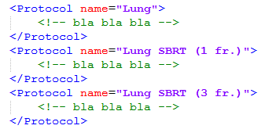

# Dosimetry.esapi.dll
Varian ESAPI script for evaluating dose objectives. Dosimetry can be used in several ways:

* To quickly apply protocol objectives to your plan and see if the plan passes.
* To fetch objectives from protocol, modify them, and see if the plan passes.
* To import objectives from protocol and insert them directly into Eclipse's optimizer as optimization objectives.
* To create a duplicate structure set, transitional structures if needed, and start a simple plan with added optimization objectives (highly experimental!)
* You can save objectives into a SQLite database for fast reviewing after the plan has been modified.


## Setup

To use the script, you must compile it on your system. You should be able to open the project with Visual Studio 2019 Community Edition. Open the .sln file in Dosimetry folder. 
The script was developed for Eclipse version 15.6. It may not work with other versions of Eclipse or Varian ESAPI.

1. You will need to restore NuGet package for compilation: System.Data.SQLite.Core. Right click the solution -> Restore NuGet packages.
2. Don't forget the references to Varian dlls.
3. Compile as Release for x64.
4. Create a SQLite database file. Edit the path to it in 'Exchange_path.db'.
5. In Eclipse you will have to approve the script because it is write-enabled.


## Database
The folder 'CreateDatabase' contains a very small project with an executable file that produces the starting SQLite database. Run the executable. You will get a 'database.db' file that you than copy to an appropriate place that will be available, like the whole script, to all the users. You can put it into the Settings folder of the script. Than put the path to the file into **Exchange_path.csv**. Be sure that the path is absolute (instead of starting with '\\', you should start with '\\\\').

```
\\\\NetworkPathToDatabase\database.db
```


## Configuration

Dosimetry uses several configuration files that must be present and in the precisely predetermined form. All must be contained in the Settings folder.

### Exchange_path.csv
As said before, this is a single-line file that contains the path to the SQLite database. It must reside in the 'Settings' folder.

### Protocols.xml
This file defines objectives. It is ordered into protocols. The demo file contains all the possible objective type you can use, so you can take it as a reference. Always edit the file with the integrated editor because that way you can validate the form of the file before saving. The editor is available in the menu bar of the main window. Password for saving is **varian**. 

You may add as many protocols as you wish. Protocols are grouped together in 'Protocol_groups.xml'. 
Each protocols contains several structures to which you wish to apply restrictions. Each Structure has a **type** and a **name**. Type can only be **Organ**, **PTV**, **CTV**, **GTV** or **ITV**. Name can be whatever.

For organs, these are the possible objective values:

|      | Possible values (organs)                                                 |
|------|--------------------------------------------------------------------------|
| type | V, V-V, D, Dmean, Dmax                                                   |
| at   | Number followed by unit Possible units depend on type: cGy, cGy2, cm3, % |
| exp  | Either 'less' or 'more'                                                  |
| than | Number followed by unit Possible units depend on type cGy, cGy2, cm3, %  |

Dmax and Dmean do not require any value for *at*. Dmax is evaluated at 0.001 cm3 of volume, not 0 cm3! Objective 'V-V' is equal to 'V0 - V_d'.

Targets (PTV, CTV etc) can have additional objectives:

|      | Possible values (targets)                                                                 |
|------|-------------------------------------------------------------------------------------------|
| type | V(BODY-PTV), D(BODY-PTV), BODY-(PTV+2cm), R50, R100                                       |
| at   | Number followed by unit. Possible units depend on type: cGy, cGy2, cm3, %                 |
| exp  | Either 'less' or 'more'                                                                   |
| than | Number followed by unit. Possible units depend on type: cGy, cGy2, cm3, %, table1, table2 |

Objectives 'V(BODY-PTV)' and 'D(BODY-PTV)' are similar to 'V' and 'D' for organs, except that you must in advance subtract BODY and PTV because this objectives is supposed to evaluate the dose outside the PTV. And for both objectives relative volume (%) pertains to the volume of the PTV. Since the objective knows nothing about the original PTV, you must define in the target datagrid (both General and Special Dosimetry) the appropriate **Reference target**. 

Objectives 'R50' and 'R100' are conformity indices. The *than* value should be either **table1** and **table2**. These two values are collected from two csv files: table1.csv and table2.csv. They contain tolerance and max values of the indices with respect to the volume of the PTV.

You can always preview protocol data by clicking the **'?'** button.


The unit cGy2 is the equivalent dose in 2 Gy per fraction. 

Evaluation of each objective returns a number with the same unit as *than*.

### Protocol_groups.xml
Here you can group together similar protocols. Say, lung protocols can be three: a plain one and two  special SBRT protocols:


And in this case the names of the protocols in the 'Protocols.xml' file must be:



The 'Default' tag for the name of the protocols just tells the program that the name of this protocol is equal to the ClinicalProtocol name. It is like adding the ClinicalProtocol name as a suffix to each Protocol name in the list.

### Structure_mapping.xml
This one is easy. Here you just define all the possible aliases for each organ at risk and target. Every new organ or target in any clinical protocol must have at least one alias!

Order of aliases is maintained during mapping. The winning alias is the one that is found first. And the program starts the search from the top of the list. Aliases are case **insensitive**. 
Each new structure must also have an alpha/beta defined. This is used only when objectives have values in terms of cGy2.

If you wish to analyze both the organ at risk and its PRV, you must input both as independent structures into the protocol and into the mapping file. If you do not do this, then the program will preferentially search for PRV structures in the structure set and map those to your organ at risk.


### Machine_settings.xml

Just read the demo files. Each linac must have certain basic data entered here. This is used only when using the function 'Create plan'.

## How to use

Well, try it out. Here are a couple of examples of proper usage.

### Example 1

1. Start by creating a plan in Eclipse. Fill in the prescription and calculate the dose. 
2. Run Dosimetry.esapi.dll.
3. Go to 'General dosimetry' and pick the protocol that is right for your case. 

### Example 2

1. The same as example 1, except that this time you have some special objectives that are not according to the protocol.
2. Go to 'Special dosimetry'. In the left table add new rows for organs at risk. Each entry should be finalized by pressing 'return'. You can also enter values in the right two tables. The first one defines the doses for targets and reference volumes. Remember, the latter are used when using objectives of type 'BODY-PTV'. And after you have defined the doses for the targets, you can add objectives in the bottom table. 

### Example 3

1. The same as example 2, except that you would like to fill all the organs at risk tables with the data from the protocol.
2. Click 'Get from protocol'. A new window will open. Pick a protocol. Click 'Display'. You can than edit certain columns. Note here that the number of fractions has an effect on how the data is fetched from the protocol. If an objective has dose defined as 'cGy2', this will be converted into nominal dose taking into account the number of fractions.
3. Click 'Import' and there you go ...

### Example 4

1. The same as example 3. Except this time you would like to save your effort.
2. After you have entered all the objectives in 'Special dosimetry', save the tables into the SQL database by clicking 'Save'.
3. Rerun Dosimetry. The last saved tables should be displayed automatically.


## Notes

1. When dose is entered in relative terms, the following applies: for organs, 100% is equal to the dose that you enter into the Normalization box above the table. For targets it is equal to the Total dose.
2. DVH is calculated with 0.1 unit precision (cGy or %).
3. Dosimetry is not compatible with Gy as the unit for dose in Eclipse.
4. Evaluation is returned in the same unit as *than*.
5. If the ID of the patient changes in Aria, then you have to change it in Dosimetry database as well, otherwise the saved tables will not be read. You can change the ID by clicking the **SQL** button in Special dosimetry.
6. The button **Add objectives** adds optimization objectives to the treatment plan by reading the tables for organs and targets.
7. The button **Create plan** offers the following options:
	* Duplicate structure set
	* Delete empty structures in the duplicate
	* Add a bolus like structure over PTV (useful for head and neck cases). The BODY structure is than extended over this virtual bolus.
	* Subtract PTVs and create additional structures for optimization. OptTarget is a structure that should have the lower objective. OptTrans is a structure that should have the upper objective for the target.
	* Add a starting plan. Define prescription. Add simple beams. Define algorithms.

## Credits

Mapping of structures to organs is partly done with:

* [https://github.com/DanHarltey/Fastenshtein](https://github.com/DanHarltey/Fastenshtein)

And here are some sources that I used:
* [Tips for VVectors and Structures in ESAPI, J. Castelo](https://jhmcastelo.medium.com/tips-for-vvectors-and-structures-in-esapi-575bc623074a)


## Important note

**Before using this program see the [licence](https://github.com/brjdenis/Dosimetry/blob/main/LICENSE) and make sure you understand it. The program comes with absolutely no guarantees of any kind.**

```
THE SOFTWARE IS PROVIDED "AS IS", WITHOUT WARRANTY OF ANY KIND, EXPRESS OR
IMPLIED, INCLUDING BUT NOT LIMITED TO THE WARRANTIES OF MERCHANTABILITY,
FITNESS FOR A PARTICULAR PURPOSE AND NONINFRINGEMENT. IN NO EVENT SHALL THE
AUTHORS OR COPYRIGHT HOLDERS BE LIABLE FOR ANY CLAIM, DAMAGES OR OTHER
LIABILITY, WHETHER IN AN ACTION OF CONTRACT, TORT OR OTHERWISE, ARISING FROM,
OUT OF OR IN CONNECTION WITH THE SOFTWARE OR THE USE OR OTHER DEALINGS IN THE
SOFTWARE.
```


## LICENSE

Published under the MIT license. 